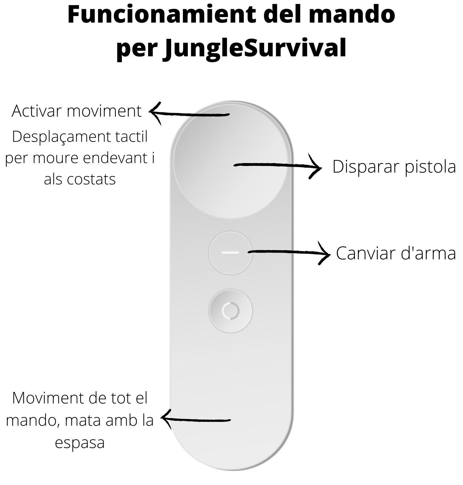

# JungleSurvival

JungleSurvival is a VR videogame with a shooter style, where the player needs to kill the 10 hidden zombies in the scene before their life finishes! The player have 3 lifes and each life means 1 minute!! 

## Play the game

To play the game you need to download and install the executable.apk file in to a VR with DayDream device.

## Features & funcionalities

The game have very simple funcionalities:
* Move arround the scene!
* Shoot to the zombies to kill them with the gun!
* Kill them with the Sword!

 

 

## Requirements

To run this application you need to have installed in you PC [Unity](https://unity3d.com/) version 2019.2.15f1 or above, with the Android and iOS modules.

## Authors

|  |  |
| ---- | ---- |
| [Carlota Catot Bragós](https://github.com/carlotacb/) | [David Aleu Moseguí](https://github.com/daleu/) | 
| _Co-developer_ | _Co-developer_ |

## License

MIT © JungleSurvival